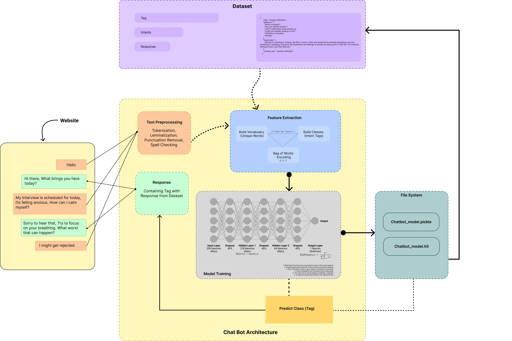

# HealthHub (Mental Health Care Chatbot)

<!-- Include image from docs directory -->



## Languages/Components Used

- Frontend: Python
- Backend: Python
- Database: MySQLite

## Installation

```
git clone
```

```
pip install -r requirements.txt
```

```
python run.py
```
